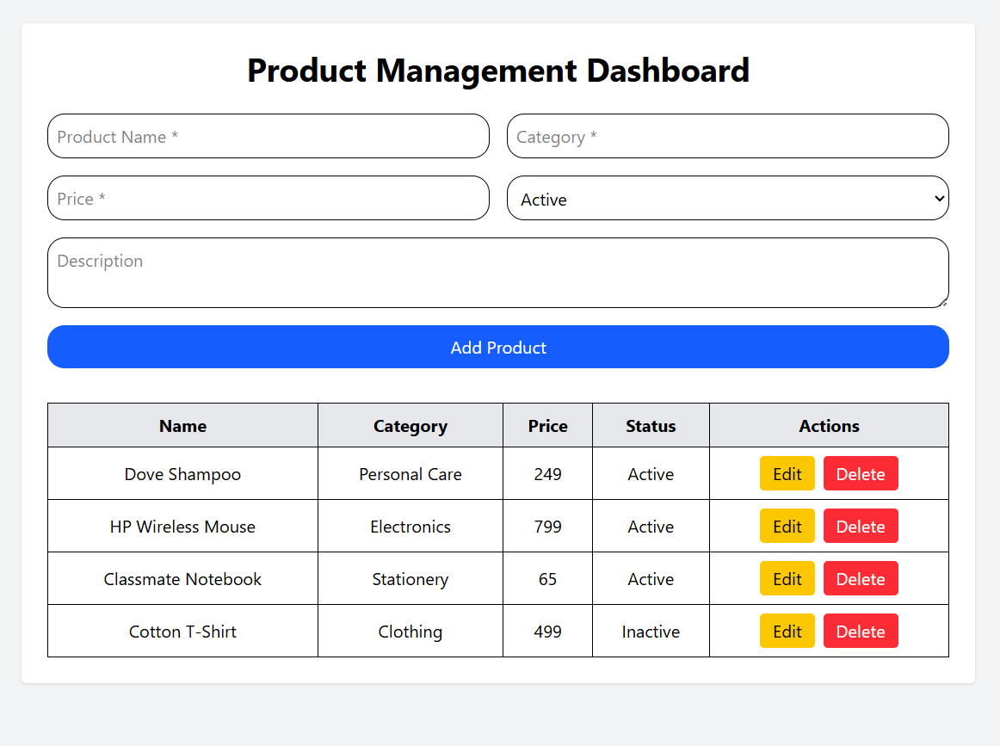

# Product Management Dashboard

A simple Product Management web application to **Add, View, Edit, and Delete products** with a clean user interface and smooth user experience.

## 📸 Screenshot

---

## 📖 Project Overview

This project allows users to manage product details efficiently.  
Users can add new products, view them in a table, update existing product information, and delete products with confirmation.

The application follows the given task requirements strictly and focuses on simplicity and usability.

---

## ⚙️ Tech Stack

- **Frontend:** React JS, Tailwind CSS
- **Backend:** Node JS (Express)

---

## ✨ Features

- Add new products with validation
- View product list in tabular format
- Edit existing product details
- Delete products with confirmation popup
- Success messages for all actions

---

## 📦 Product Details

- Product Name
- Product Category
- Product Price
- Product Description
- Product Status (Active / Inactive)

---

## 👤 Author

Developed by **Azam**
